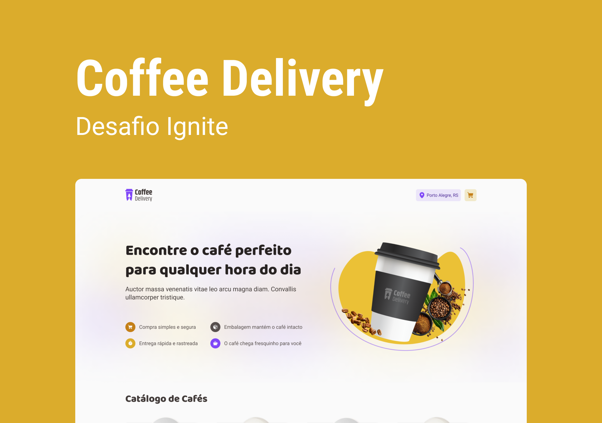

<h1 align="center"> COFFEE DELIVERY </h1>

Um delivery de café, projeto proposto como desafio pela Rocketseat.
 
Saiba mais acessando os links abaixo...

  <a href="#-tecnologias">Tecnologias</a>&nbsp;&nbsp;&nbsp;|&nbsp;&nbsp;&nbsp;
  <a href="#-projeto">Projeto</a>&nbsp;&nbsp;&nbsp;|&nbsp;&nbsp;&nbsp;
  <a href="#-layout">Layout</a>&nbsp;&nbsp;&nbsp;|&nbsp;&nbsp;&nbsp;
  <a href="#memo-licença">Licença</a>

  

 

  

## 🚀 Tecnologias

Esse projeto foi desenvolvido com as seguintes tecnologias:

- Vite
- Styled Components
- Local Storage
- Typescript
- Context API
- React
- React Router Dom
- React Hook Form
- Validação de formulário com Zod

## 💻 Projeto

Durante este desafio, utilizamos conceitos um pouco mais avançados desenvolvendo do zero uma aplicação de encomenda de cafés! A aplicação conta com 3 telas sendo a primeira uma tela de apresentação e também de listagem dos cafés disponíveis. Na segunda tela, o usuário precisa preencher um formulário com seus dados de endereço e ao lado direito é possível visualizar os itens do carrinho, podendo alterar a quantidade ou remover o mesmo. Na terceira e última tela, é exibido uma confirmação do pedido e também os detalhes de entrega da compra.

## 🔖 Layout

Você pode visualizar o layout do projeto através [DESSE LINK](https://www.figma.com/file/STiOVF0V4d4hzhjI9682D2/Coffee-Delivery-Copy?fuid=977602703130743767). É necessário ter conta no [Figma](https://figma.com) para acessá-lo.

## :memo: Licença

Esse projeto está sob a licença MIT.

---

Feito com 💙 by [Salinas](https://www.instagram.com/_eosalinas)
